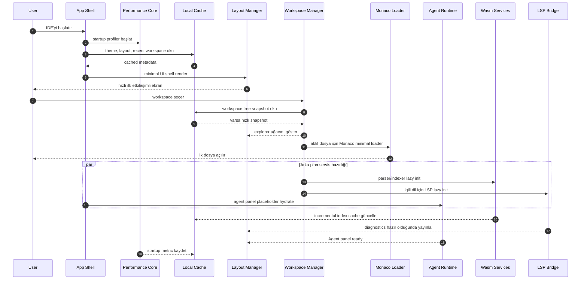
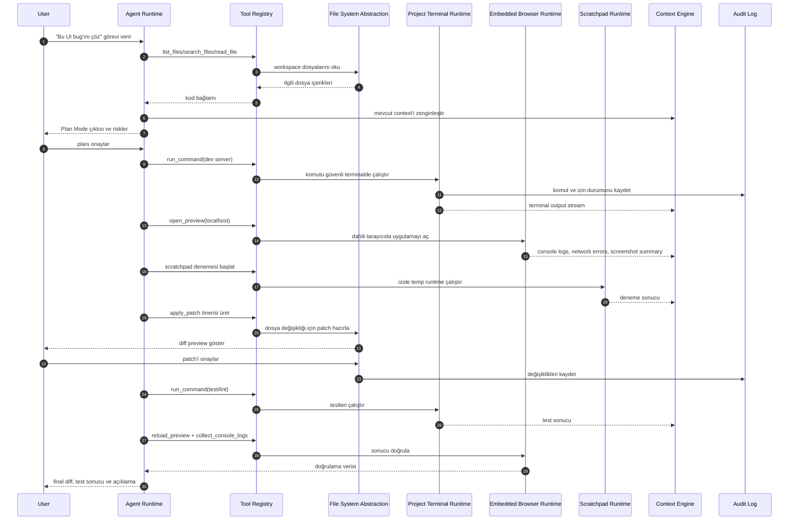
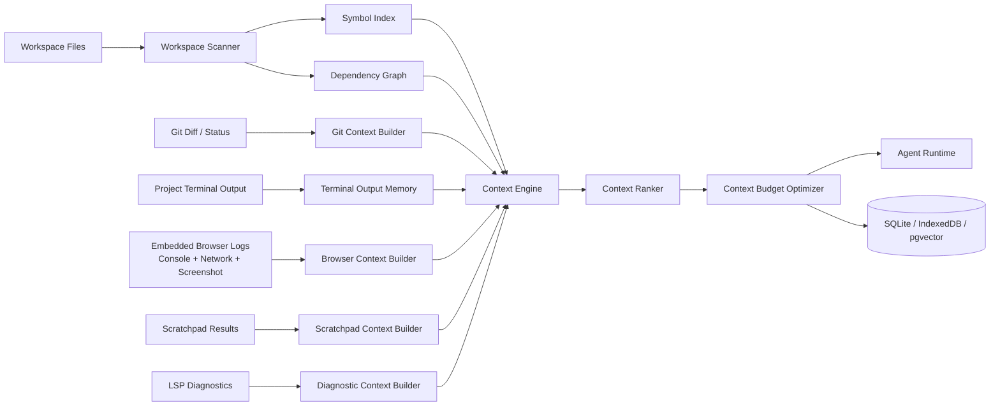
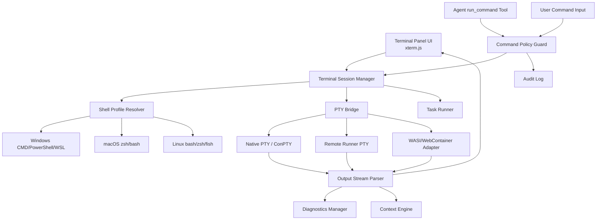
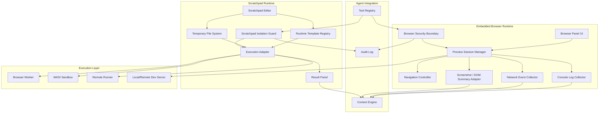

# Proje Başlığı: Yeni Nesil WebAssembly Tabanlı, Ajan Odaklı AI Geliştirme Ortamı

Aşağıdaki plan bir **baş mimar / teknik danışman** perspektifiyle hazırlanmıştır. Projenin vizyonu güçlü; ancak özellikle "abonelik tabanlı AI erişimi", "tarayıcıda gerçek Agent Mode", "Wasm tabanlı IDE çekirdeği" ve "Codium/VS Code uyumluluğu" konuları çok dikkatli tasarlanmalıdır. En kritik tavsiye: **VS Code/Codium'u doğrudan fork'layıp Wasm'a taşımaya çalışmak yerine, Monaco + WebContainer/WASI + Rust/Wasm servisleri + kendi Agent Runtime katmanınızla modüler bir IDE platformu kurmanızdır.**

---

# 1. Ürün Vizyonu ve Mimari Pozisyonlama

## Hedef

Hem masaüstünde hem tarayıcıda çalışabilen, AI agent'ları merkeze alan, WebAssembly destekli yeni nesil bir IDE geliştirmek.

Bu IDE yalnızca:

- kod tamamlama,
- chat paneli,
- diff önerisi,
- basit refactor

sunmamalı; bunun yerine:

- projeyi indeksleyebilen,
- dosya sistemini anlayabilen,
- plan yapabilen,
- görevleri adımlara bölebilen,
- kodu değiştirebilen,
- test/build/lint çalıştırabilen,
- kullanıcı onayıyla aksiyon alabilen,
- farklı LLM sağlayıcılarını agent modunda kullanabilen

bir **AI-native IDE platformu** olmalı.

---

# 2. Temel Mimari Karar

## Önerilen Strateji

Bu projede üç olası yaklaşım var:

| Yaklaşım                                        | Avantaj                                        | Dezavantaj                                                                  | Tavsiye                              |
| ----------------------------------------------- | ---------------------------------------------- | --------------------------------------------------------------------------- | ------------------------------------ |
| VS Code/Codium fork                             | Zengin eklenti ekosistemi, oturmuş UX          | Ağır Electron mimarisi, fork bakımı zor, Wasm'a tam uyarlamak çok maliyetli | Kısa vadeli ürün için riskli         |
| Zed benzeri sıfırdan Rust GUI                   | Çok hızlı, modern                              | IDE feature set'ini sıfırdan yazmak pahalı                                  | Uzun vadede mümkün ama MVP için ağır |
| Monaco + Wasm servisleri + custom Agent Runtime | Web ve desktop uyumu güçlü, modüler, MVP hızlı | Extension compatibility sınırlı başlar                                      | En uygun yaklaşım                    |

## Ana Tavsiye

Başlangıçta şu mimariyi öneririm:

```txt
Frontend Shell
 ├─ Web: React/Solid/Svelte + Monaco Editor
 ├─ Desktop: Tauri v2 wrapper
 ├─ Mobile/tablet ileride mümkün
 │
IDE Runtime Layer
 ├─ Workspace Manager
 ├─ File System Abstraction
 ├─ Terminal/Command Bridge
 ├─ Language Services Bridge
 ├─ Extension API Subset
 │
Wasm Services
 ├─ Parser services: tree-sitter-wasm
 ├─ Formatter/linter wasm modules
 ├─ Search/indexing engine
 ├─ Git diff/analyzer service
 ├─ Optional WASI command sandbox
 │
Agent Runtime
 ├─ Plan Mode Orchestrator
 ├─ Act Mode Orchestrator
 ├─ Tool Registry
 ├─ Context Builder
 ├─ Memory/Index Store
 ├─ Approval/Governance Layer
 │
AI Provider Gateway
 ├─ OpenAI API connector
 ├─ Anthropic API connector
 ├─ Local models connector
 ├─ BYOK connector
 ├─ Subscription/session connectors where legal/allowed
 │
Backend / Cloud Control Plane
 ├─ Auth
 ├─ Billing
 ├─ Team/workspace sync
 ├─ Provider token vault
 ├─ Agent execution logs
 ├─ Policy/rate-limit layer
```

---

# 3. Tech Stack Önerisi

## 3.1 Frontend / IDE Arayüzü

### Web UI

Öneriler:

- **TypeScript** zorunlu olmalı.
- UI için:
  - React + Zustand/Jotai,
  - veya SolidJS,
  - veya SvelteKit.

Benim pratik önerim:

```txt
React + TypeScript + Vite + Monaco Editor + xterm.js
```

Neden?

- Monaco, VS Code editör çekirdeğine en yakın deneyimi verir.
- Web IDE için en olgun editör bileşenlerinden biridir.
- LSP, diagnostics, semantic tokens, diff editor gibi ihtiyaçlara uyumludur.

Alternatif:

- CodeMirror 6 daha hafif ve modülerdir.
- Ama "VS Code benzeri IDE hissi" isteniyorsa Monaco daha doğru başlangıçtır.

---

## 3.2 Desktop Katmanı

### Tauri v2

Masaüstü için önerim:

```txt
Tauri v2 + Rust backend + WebView frontend
```

Electron yerine Tauri tercih etme sebepleri:

- Daha hafif binary.
- Rust ile native sistem erişimi.
- Web frontend ile aynı kod tabanını paylaşma.
- File system, process, terminal, Git gibi native özellikleri kontrollü expose etme.

Desktop mimarisi:

```txt
Tauri App
 ├─ Web frontend bundle
 ├─ Rust command bridge
 ├─ Native FS access
 ├─ Native terminal/PTY
 ├─ Git integration
 ├─ Secure credential storage
 └─ Local Agent Runtime acceleration
```

---

## 3.3 WebAssembly Katmanı

Wasm'ı "her şeyi Wasm yapalım" diye değil, doğru yerlere koymak gerekir.

### Wasm için doğru kullanım alanları

1. **Parser ve syntax analysis**
   - tree-sitter-wasm
   - ast-grep wasm

2. **Code search / indexing**
   - Rust ile yazılmış indexing engine → wasm32 target
   - ripgrep benzeri arama motoru web uyumlu hale getirilebilir

3. **Formatters / linters**
   - Prettier native JS kalabilir.
   - Biome/Rome tarzı Rust tabanlı araçlar Wasm'a uygun.
   - dprint plugin sistemi değerlendirilebilir.

4. **Git diff / patch analysis**
   - diff engine Rust/Wasm olabilir.

5. **Sandboxed tool execution**
   - WASI Preview 2 / WASIX / Wasmtime desktop tarafında.
   - Browser tarafında sınırlı WASI simülasyonu.

6. **Language intelligence helpers**
   - LSP'nin tamamını tarayıcıda çalıştırmak zordur.
   - Ama bazı lightweight analyzers Wasm olabilir.

### Wasm için riskli alanlar

- Tam terminal emülasyonu.
- Native build sistemleri.
- Docker benzeri izolasyon.
- Büyük repo üzerinde sürekli indexing.
- Tüm VS Code extension host'unu Wasm'a taşımak.

Bunlar için hibrit model gerekir.

---

## 3.4 Language Server Protocol

Mimari olarak LSP desteği kritik.

Önerilen yapı:

```txt
Browser Mode
 ├─ Web Worker LSP clients
 ├─ wasm-based lightweight analyzers
 ├─ remote LSP bridge optional

Desktop Mode
 ├─ Native LSP processes
 ├─ Rust/Tauri process manager
 ├─ stdio/websocket LSP bridge
```

Örnek:

- TypeScript: `typescript-language-server` desktop'ta native process.
- Python: `pyright` veya `ruff server`.
- Rust: `rust-analyzer` desktop'ta native.
- Browser'da ise:
  - remote LSP server,
  - container/webcontainer,
  - veya sınırlı semantic support.

---

# 4. Codium / VS Code ile İlişki Stratejisi

Codium'u doğrudan ana taban olarak almak cazip görünebilir; fakat bu uzun vadede şu sorunları çıkarır:

- Electron bağımlılığı.
- Büyük kod tabanı.
- Extension API karmaşıklığı.
- Microsoft marketplace lisans/erişim konuları.
- WebAssembly dönüşümü için çok fazla iç bağımlılık.
- Ürün farklılaşmasının zorlaşması.

## Daha doğru strateji

### "VS Code uyumlu ama VS Code fork'u olmayan IDE"

Yani:

```txt
Monaco Editor
+ VS Code theme/keybinding compatibility
+ VS Code extension API subset
+ Open VSX Registry entegrasyonu
+ kendi Agent Runtime
```

Başlangıçta desteklenecek VS Code uyumlulukları:

- Theme formatları.
- Keybindings.
- Snippets.
- TextMate grammars.
- Language configurations.
- Bazı LSP extension'ları.

Daha sonra:

- Extension Host compatibility layer.
- Web extension API subset.
- Open VSX marketplace.

Böylece hem tanıdık UX elde edilir hem de mimari kontrol kaybedilmez.

---

# 5. Sistem Mimarisi

## 5.1 Yüksek Seviye Mimari

```txt
                          ┌────────────────────────────┐
                          │        User Interface       │
                          │ Monaco / Panels / Terminal  │
                          └─────────────┬──────────────┘
                                        │
                          ┌─────────────▼──────────────┐
                          │       IDE Core Runtime      │
                          │ Workspace, FS, Git, LSP     │
                          └─────────────┬──────────────┘
                                        │
            ┌───────────────────────────┼───────────────────────────┐
            │                           │                           │
┌───────────▼───────────┐   ┌───────────▼───────────┐   ┌───────────▼───────────┐
│     Wasm Services     │   │     Agent Runtime      │   │   Extension Runtime   │
│ Parser, index, diff   │   │ Plan/Act/tool calling  │   │ Themes/snippets/LSP   │
└───────────┬───────────┘   └───────────┬───────────┘   └───────────┬───────────┘
            │                           │                           │
            └───────────────┬───────────┴───────────────┬───────────┘
                            │                           │
              ┌─────────────▼─────────────┐   ┌─────────▼──────────┐
              │   AI Provider Gateway     │   │ Native/Web Bridge   │
              │ API, OAuth, sessions      │   │ FS, terminal, LSP    │
              └─────────────┬─────────────┘   └─────────┬──────────┘
                            │                           │
              ┌─────────────▼─────────────┐   ┌─────────▼──────────┐
              │ Cloud Control Plane       │   │ Local Desktop Host  │
              │ Auth, vault, logs, teams  │   │ Tauri Rust backend   │
              └───────────────────────────┘   └────────────────────┘
```

---

# 6. Agent Runtime Tasarımı

Projenin kalbi burası olmalı.

## 6.1 Agent modları

### Chat Mode

Basit konuşma ve açıklama modu.

### Plan Mode

Agent:

- repo yapısını okur,
- ilgili dosyaları bulur,
- hedefi parçalara böler,
- riskleri ve etkilenen modülleri belirtir,
- uygulanabilir plan çıkarır,
- kullanıcıdan onay ister.

### Act Mode

Agent:

- dosya okur,
- patch üretir,
- komut çalıştırır,
- test/lint/build yapar,
- hataları analiz eder,
- gerekirse tekrar düzeltir,
- kullanıcı onayı gerektiren işlemleri bekletir.

### Review Mode

Agent:

- diff inceler,
- güvenlik riski arar,
- mimari ihlal tespit eder,
- test eksikliği bulur.

### Architect Mode

Büyük tasarım kararları ve refactor planları için özel mod.

---

## 6.2 Tool Registry

Agent'ın doğrudan her şeye erişmemesi gerekir. Tüm eylemler araçlar üzerinden yapılmalı.

```txt
Tool Registry
 ├─ read_file
 ├─ write_file / apply_patch
 ├─ search_files
 ├─ list_files
 ├─ run_command
 ├─ git_diff
 ├─ run_tests
 ├─ browser_preview
 ├─ lsp_diagnostics
 ├─ package_manager
 └─ mcp_tools
```

Her tool için policy gerekir:

```txt
Tool Policy
 ├─ read-only
 ├─ safe write
 ├─ destructive write
 ├─ network access
 ├─ secret access
 ├─ shell execution
 └─ requires explicit approval
```

---

## 6.3 Context Engine

LLM ajan kalitesinin en önemli belirleyicisi context sistemidir.

Önerilen bileşenler:

```txt
Context Engine
 ├─ Workspace scanner
 ├─ Symbol index
 ├─ Dependency graph
 ├─ Recent files
 ├─ Git diff context
 ├─ Terminal output memory
 ├─ Error/diagnostic context
 ├─ Embedding vector store
 └─ Agent scratchpad/state
```

Teknik öneriler:

- Küçük/orta projelerde local SQLite + vector extension.
- Web tarafında IndexedDB.
- Desktop'ta SQLite/libSQL.
- Büyük ekip planında cloud sync opsiyonel.

---

# 7. Abonelik Tabanlı AI Entegrasyonu

Bu en kritik ve en riskli alan.

## 7.1 Gerçekçi Değerlendirme

Kullanıcıların ChatGPT, Claude, Windsurf, Open Coder gibi platformlardaki mevcut aboneliklerini "bağlayıp" sizin IDE'nizden agent çalıştırmak teknik olarak cazip; fakat çoğu sağlayıcı için şu riskleri taşır:

1. **Resmi OAuth/API yoksa session kullanmak ToS ihlali olabilir.**
2. ChatGPT web session scraping kırılgandır.
3. Claude web session automation güvenlik ve kullanım şartları açısından risklidir.
4. Sağlayıcılar bot trafiğini engelleyebilir.
5. Hesap kilitlenmesi / rate-limit / CAPTCHA sorunları çıkabilir.
6. Kurumsal müşteriler bunu kabul etmeyebilir.

Bu nedenle ürün mimarisini "session hijack/scraping" üzerine kurmanızı önermem.

## 7.2 Tavsiye Edilen AI Provider Modeli

Dört katmanlı model öneririm:

```txt
AI Access Model
 ├─ Official API Key / BYOK
 ├─ OAuth-supported providers
 ├─ Enterprise managed providers
 └─ User-side local connector / browser extension bridge
```

### 1. BYOK - Bring Your Own Key

İlk ve en güvenli model.

- OpenAI API key.
- Anthropic API key.
- Google AI Studio / Vertex.
- Groq.
- Mistral.
- OpenRouter.
- Together.
- DeepSeek.
- Local Ollama.

### 2. Resmi OAuth Destekleyen Sağlayıcılar

Eğer sağlayıcı resmi OAuth veriyorsa:

```txt
User → OAuth Login → Provider → Token Vault → AI Gateway
```

Token'lar:

- desktop'ta OS keychain,
- web'de backend vault,
- enterprise'da müşteri KMS/HSM

içinde saklanmalı.

### 3. Enterprise Provider Gateway

Kurumsal kullanıcılar için:

- Azure OpenAI.
- AWS Bedrock.
- Google Vertex AI.
- Anthropic Console team keys.
- OpenAI Enterprise.

### 4. Local User Connector

"Benim mevcut web aboneliğimi kullanmak istiyorum" talebi için en güvenli ara model:

```txt
IDE ↔ Local Connector ↔ User Browser Session
```

Bu modelde:

- session sizin sunucunuza gitmez,
- kullanıcı kendi makinesinde lokal bridge çalıştırır,
- sağlayıcının izin verdiği ölçüde browser automation yapılabilir,
- yine de ToS riski kullanıcıya açıkça belirtilmelidir.

Ancak bunu ana ürün vaadi yapmanızı önermem. Daha çok "experimental/personal connector" olarak konumlandırılmalı.

---

## 7.3 AI Gateway Mimarisi

```txt
                 ┌──────────────────────┐
                 │      Agent Runtime    │
                 └──────────┬───────────┘
                            │
                 ┌──────────▼───────────┐
                 │   Model Router        │
                 │ cost/context/capable  │
                 └──────────┬───────────┘
                            │
     ┌──────────────────────┼──────────────────────┐
     │                      │                      │
┌────▼─────┐          ┌─────▼─────┐          ┌─────▼─────┐
│ OpenAI   │          │ Anthropic │          │ Local LLM │
│ API/OAuth│          │ API/OAuth │          │ Ollama    │
└────┬─────┘          └─────┬─────┘          └─────┬─────┘
     │                      │                      │
┌────▼──────────────────────▼──────────────────────▼────┐
│ Token Vault / Keychain / Policy / Audit / Rate Limits  │
└────────────────────────────────────────────────────────┘
```

Model Router karar kriterleri:

- context window,
- tool calling desteği,
- maliyet,
- latency,
- privacy seviyesi,
- coding benchmark skorları,
- kullanıcı tercihi,
- görevin risk seviyesi.

---

# 8. Dosya Sistemi ve Agent Mode Zorlukları

## 8.1 Desktop

Desktop tarafında Tauri ile sorun daha kolay çözülür:

```txt
Tauri Rust Backend
 ├─ kullanıcı workspace seçer
 ├─ izin verilen kök dizin kaydedilir
 ├─ agent sadece o sandbox içinde çalışır
 ├─ destructive işlemler onay ister
 └─ shell komutları policy ile sınırlandırılır
```

## 8.2 Browser

Browser'da gerçek dosya erişimi daha karmaşık.

Seçenekler:

### 1. File System Access API

Chrome/Edge tabanlı tarayıcılarda güçlüdür.

Avantaj:

- Yerel klasör açılabilir.
- Dosya okunabilir/yazılabilir.

Dezavantaj:

- Firefox/Safari desteği sınırlı.
- İzinler kullanıcı gesture gerektirir.
- Background agent davranışı kısıtlı.

### 2. OPFS - Origin Private File System

Avantaj:

- Browser içinde kalıcı dosya alanı.
- WebContainer benzeri ortamlar için uygun.

Dezavantaj:

- Kullanıcının gerçek projesiyle sync gerekir.

### 3. Git-backed Workspace

Web IDE için en temiz model:

```txt
GitHub/GitLab OAuth → repo clone/import → browser/cloud workspace → commit/PR
```

Avantaj:

- Web'de agent işlemleri kontrollü olur.
- PR tabanlı güvenli workflow kurulabilir.

Dezavantaj:

- Tam offline local proje deneyimi vermez.

### 4. Remote Dev Container

Web için profesyonel çözüm:

```txt
Browser IDE → Remote Workspace Container → Agent Tools → Git Provider
```

Bu model Codespaces benzeri çalışır.

---

# 9. Terminal ve Build Çalıştırma

## Browser

Seçenekler:

1. WebContainers
   - StackBlitz tarzı Node.js odaklı ortam.
   - Lisans/entegrasyon koşulları incelenmeli.

2. WASI sandbox
   - Bazı CLI araçları için uygun.
   - Genel amaçlı build için sınırlı.

3. Remote runner
   - En güçlü ve gerçekçi çözüm.
   - Cloud veya user machine agent.

## Desktop

Tauri ile native PTY kullanılmalı:

- Windows: ConPTY.
- macOS/Linux: pty.
- xterm.js frontend.

Agent komut çalıştırırken:

- çalışma dizini kısıtlanmalı,
- network komutları policy'ye bağlı olmalı,
- `rm -rf`, `del`, credential erişimi gibi işlemler onay istemeli,
- terminal output context engine'e aktarılmalı.

---

# 10. Güvenlik ve Governance

Bu IDE agent odaklı olduğu için güvenlik mimarisi ürünün çekirdeği olmalı.

## 10.1 Agent İzin Modeli

```txt
Permission Levels
 ├─ Observe: yalnızca okuma
 ├─ Suggest: patch önerir ama yazmaz
 ├─ Edit: dosya değiştirir, onaylı
 ├─ Execute: komut çalıştırır, onaylı
 ├─ Autonomous: belirli policy içinde otomatik
```

## 10.2 Risk Sınıflandırması

```txt
Low Risk
 ├─ dosya okuma
 ├─ search
 ├─ diff üretme

Medium Risk
 ├─ kaynak kodu değiştirme
 ├─ test çalıştırma
 ├─ package install

High Risk
 ├─ secret dosyalarına erişim
 ├─ network upload
 ├─ destructive shell command
 ├─ git push
 ├─ production config değişimi
```

## 10.3 Audit Log

Her agent aksiyonu kaydedilmeli:

```txt
Agent Action Log
 ├─ timestamp
 ├─ model/provider
 ├─ prompt/context hash
 ├─ tool called
 ├─ input/output summary
 ├─ files changed
 ├─ user approval state
 └─ resulting diff
```

Bu kurumsal satış için çok önemli.

---

# 11. MVP Yol Haritası

## Faz 0 — Teknik Doğrulama / Spike

Süre: 2-4 hafta

Amaç: En riskli varsayımları test etmek.

Deliverable:

- Monaco tabanlı minimal editor.
- Tauri desktop shell.
- Web build.
- Basit workspace açma.
- File read/write abstraction.
- xterm.js terminal desktop'ta çalışıyor.
- Basit OpenAI/Anthropic API çağrısı.
- Agent'ın dosya okuyup patch önermesi.

Başarı kriteri:

- Aynı frontend web ve desktop'ta çalışıyor.
- Agent tek bir dosyada güvenli patch önerebiliyor.
- Desktop'ta komut çalıştırma POC çalışıyor.

---

## Faz 1 — MVP IDE + Agent Core

Süre: 8-12 hafta

Özellikler:

- Workspace explorer.
- Monaco editor tabs.
- Search panel.
- Git diff viewer.
- Basic LSP integration.
- Agent Chat Mode.
- Agent Plan Mode.
- Agent Act Mode limited.
- Tool registry.
- Apply patch workflow.
- BYOK provider integration.
- Local credential storage.

MVP kapsamı:

```txt
Desktop-first MVP
Web companion mode
```

Neden desktop-first?

Çünkü Agent Mode için:

- dosya erişimi,
- terminal,
- LSP,
- Git,
- package manager

desktop'ta çok daha güvenilir.

Web sürümü bu aşamada:

- GitHub repo import,
- read-only veya sandboxed edit,
- BYOK chat/plan,
- sınırlı act mode

sunabilir.

---

## Faz 2 — Web Agent Workspace

Süre: 10-16 hafta

Özellikler:

- GitHub/GitLab OAuth.
- Repo import.
- Browser IndexedDB/OPFS workspace.
- Remote runner veya container execution.
- PR oluşturma.
- Web'de gerçek Plan/Act Mode.
- Background indexing.
- Wasm parser/search engine.

Başarı kriteri:

- Kullanıcı tarayıcıdan repo açar.
- Agent issue/feature task alır.
- Plan üretir.
- Branch oluşturur.
- Kod değiştirir.
- Test çalıştırır.
- PR açar.

---

## Faz 3 — Extension ve Ecosystem

Süre: 12-20 hafta

Özellikler:

- Open VSX integration.
- Theme/snippet/keybinding desteği.
- Web extension API subset.
- Custom plugin SDK.
- MCP server/client entegrasyonu.
- Agent tool marketplace.

Burada amaç VS Code ekosisteminden kademeli faydalanmak.

---

## Faz 4 — Subscription/OAuth AI Integrations

Süre: paralel, ancak dikkatli ilerlemeli

Özellikler:

- Official OAuth sağlayıcıları.
- Enterprise provider config.
- Secure token vault.
- Provider policy engine.
- Local connector experimental.
- Multi-model routing.

Önemli not:

ChatGPT/Claude web aboneliğini doğrudan session üzerinden agent'a bağlama konusu ayrı bir "experimental connector" olarak ele alınmalı; ana ürün mimarisine bağımlı olmamalı.

---

## Faz 5 — Enterprise / Team Features

Özellikler:

- Team workspaces.
- Shared rules/prompts.
- Policy management.
- Audit logs.
- SSO/SAML/OIDC.
- Private model gateway.
- On-prem deployment.
- Compliance reporting.

---

# 12. Önerilen Repo / Paket Yapısı

Monorepo öneririm:

```txt
webassembly-ide/
 ├─ apps/
 │   ├─ desktop/              # Tauri app
 │   ├─ web/                  # Browser app
 │   └─ docs/                 # Documentation site
 │
 ├─ packages/
 │   ├─ ui/                   # Shared UI components
 │   ├─ editor/               # Monaco integration
 │   ├─ ide-core/             # Workspace, FS, tabs, layout
 │   ├─ agent-runtime/        # Plan/Act/Chat orchestration
 │   ├─ agent-tools/          # Tool registry
 │   ├─ ai-gateway/           # Provider abstraction
 │   ├─ lsp-client/           # LSP bridge
 │   ├─ extension-api/        # Plugin compatibility layer
 │   └─ shared/               # Types, utilities
 │
 ├─ crates/
 │   ├─ wasm-indexer/         # Rust/Wasm indexing
 │   ├─ wasm-diff/            # Diff/patch helpers
 │   ├─ wasm-parser/          # Tree-sitter wrappers
 │   └─ desktop-host/         # Tauri Rust commands
 │
 ├─ services/
 │   ├─ api/                  # Cloud control plane
 │   ├─ auth/                 # OAuth/OIDC
 │   ├─ token-vault/          # Credential storage service
 │   └─ runner/               # Remote execution workers
 │
 └─ docs/
     ├─ architecture.md
     ├─ security.md
     ├─ agent-runtime.md
     └─ provider-integrations.md
```

---

# 13. Önerilen Teknoloji Listesi

## Frontend

```txt
TypeScript
React
Vite
Monaco Editor
xterm.js
Zustand or Jotai
TanStack Query
Tailwind CSS or UnoCSS
```

## Desktop

```txt
Tauri v2
Rust
tauri-plugin-fs
tauri-plugin-shell
tauri-plugin-store
keyring/secure storage
portable PTY integration
```

## Wasm / Rust

```txt
Rust
wasm-bindgen
wasm-pack
WASI Preview 2
tree-sitter-wasm
serde
tokio desktop side
```

## Backend

```txt
Node.js/NestJS or Rust/Axum
PostgreSQL
Redis
Object storage
OIDC/OAuth
Vault/KMS
```

Benim önerim:

- Ürün frontend ağırlıklı olduğu için backend'de ilk aşamada **Node.js/NestJS** hızlı olabilir.
- Performans kritik gateway/runner parçaları ileride **Rust/Axum** olabilir.

## AI

```txt
OpenAI Responses API / Chat Completions
Anthropic Messages API
OpenRouter
Google Gemini
Ollama local
LiteLLM-compatible abstraction optional
```

## Index / Memory

```txt
Desktop: SQLite/libSQL
Web: IndexedDB
Cloud: Postgres + pgvector
```

---

# 14. En Büyük Teknik Zorluklar ve Çözüm Önerileri

## Zorluk 1: Tarayıcıda gerçek dosya sistemi erişimi

Çözüm:

- Chrome için File System Access API.
- Genel web için Git-backed workspace.
- Profesyonel kullanım için remote container.
- Desktop için Tauri native FS.

## Zorluk 2: Tarayıcıda terminal ve build çalıştırma

Çözüm:

- Basit Node projeleri için WebContainer opsiyonu.
- Genel amaçlı kullanım için remote runner.
- Desktop'ta native PTY.

## Zorluk 3: LLM subscription/session entegrasyonu

Çözüm:

- Ana model: resmi API/BYOK/OAuth.
- Enterprise: provider gateway.
- Web subscription bridging: yalnızca experimental local connector.
- ToS ve kullanıcı güvenliği net şekilde belgelenmeli.

## Zorluk 4: VS Code extension uyumluluğu

Çözüm:

- Tam uyumluluğu MVP hedefi yapmayın.
- Theme/snippet/keybinding/TextMate grammar ile başlayın.
- Web extension subset ekleyin.
- Open VSX entegrasyonunu kademeli yapın.

## Zorluk 5: Agent'ın güvenli aksiyon alması

Çözüm:

- Tool registry.
- Permission policy.
- Approval workflow.
- Diff-first editing.
- Audit log.
- Sandbox.

## Zorluk 6: Büyük repo context yönetimi

Çözüm:

- Symbol index.
- Dependency graph.
- Embedding search.
- Incremental indexing.
- Git diff context.
- Context budget optimizer.

---

# 15. Ürün Farklılaştırma Stratejisi

Piyasadaki VS Code tabanlı AI eklentilerinden ayrışmak için şunlara odaklanmalısınız:

1. **Agent-first UX**
   - IDE içinde chat paneli değil, agent workflow merkezi.

2. **Plan/Act ayrımı**
   - Kullanıcı güveni için şart.

3. **Multi-provider AI routing**
   - Tek model bağımlılığı olmamalı.

4. **Wasm-powered local intelligence**
   - Hızlı parse, search, diff, index.

5. **Web + desktop aynı çekirdek**
   - Gerçek cross-platform avantaj.

6. **Security/audit by design**
   - Enterprise için kritik.

7. **MCP ve tool marketplace**
   - Agent ekosistemini genişletir.

---

# 16. İlk 90 Günlük Somut Plan

## Gün 0-15

- Monorepo kurulumu.
- Web app + desktop app iskeleti.
- Monaco editor entegrasyonu.
- Workspace file abstraction.
- Tauri FS bridge.

## Gün 15-30

- Basic explorer/tabs/search.
- xterm.js + desktop shell integration.
- OpenAI/Anthropic BYOK connector.
- Basic chat sidebar.

## Gün 30-45

- Agent tool registry.
- read/search/apply_patch tools.
- Plan Mode prompt architecture.
- Act Mode restricted workflow.
- Diff preview.

## Gün 45-60

- Git integration.
- terminal command execution with approval.
- test/lint output parsing.
- local SQLite/IndexedDB context store.

## Gün 60-75

- Wasm parser/indexing POC.
- tree-sitter integration.
- file symbol extraction.
- context ranking.

## Gün 75-90

- MVP polish.
- security permission model.
- agent action logs.
- basic provider router.
- demo workflows:
  - "bug fix agent",
  - "write tests agent",
  - "refactor plan agent".

---

# 17. Kritik Mimari Tavsiyeler

## 1. Önce desktop-first agent deneyimi kurun

Tarayıcı hedefi önemli; fakat gerçek agent mode için desktop daha hızlı başarı sağlar.

## 2. Web'i Git-backed ve remote-runner odaklı tasarlayın

Browser'da native terminal/build beklentisi gerçekçi değil. Web tarafı için:

```txt
Repo import → sandbox edit → remote run → PR
```

en sağlıklı model.

## 3. Codium fork yerine uyumluluk katmanı geliştirin

Bu size mimari özgürlük verir.

## 4. Subscription/session entegrasyonunu ana ürün vaadi yaparken dikkatli olun

Resmi API/OAuth olmadan web session kullanımı kırılgan ve hukuki risklidir.

## 5. Agent Runtime'ı IDE'den bağımsız paket olarak tasarlayın

İleride:

- CLI agent,
- cloud agent,
- CI agent,
- GitHub bot,
- MCP server

olarak tekrar kullanabilirsiniz.

---

# 18. Nihai Önerilen MVP Tanımı

İlk MVP şöyle olmalı:

```txt
Tauri desktop app + web companion
Monaco-based editor
Workspace explorer
Git diff
Terminal
BYOK OpenAI/Anthropic
Agent Chat Mode
Agent Plan Mode
Limited Act Mode
Tool approval system
Patch preview/apply
Wasm-based code search/parser POC
```

Bu MVP ile gösterebileceğiniz demo:

1. Kullanıcı bir repo açar.
2. Agent'a "bu bug'ı çöz" der.
3. Agent repo yapısını inceler.
4. Plan Mode'da yapılacakları listeler.
5. Kullanıcı onay verir.
6. Act Mode dosyaları değiştirir.
7. Test komutunu çalıştırır.
8. Hata varsa düzeltir.
9. Final diff ve açıklama sunar.

Bu demo yatırımcı, erken kullanıcı ve teknik ekip için yeterince güçlü olur.

---

# 19. Güncellenmiş Detaylı Mimari: Performans, DX, Dahili Tarayıcı, Scratchpad ve Proje Terminali

Bu bölüm, mimarinin eksik kalan modern IDE gereksinimlerini tamamlar:

- çok hızlı açılış süresi,
- esnek ve kolay geliştirilebilir mimari,
- dahili tarayıcı,
- scratchpad / hızlı deneme alanı,
- projenin kendisine ait entegre terminali,
- katmanlar arası veri akışının netleştirilmesi,
- Agent Runtime ile bu modüllerin güvenli entegrasyonu.

Bu güncellemenin ana hedefi, IDE'nin yalnızca AI destekli bir editör değil; **hızlı açılan, modüler genişleyen, uygulama geliştirme ve test döngüsünü IDE dışına çıkmadan tamamlatan agent-first geliştirme platformu** olmasıdır.

---

## 19.1 Erişilebilirlik (Accessibility) Stratejisi

IDE'nin tüm kullanıcılar tarafından kullanılabilir olması için erişilebilirlik mimariye dahil edilmelidir.

### Accessibility İlkeleri

```txt
Accessibility Principles
 ├─ WCAG 2.1 AA uyumluluğu
 ├─ Ekran okuyucu desteği (NVDA, JAWS, VoiceOver)
 ├─ Yüksek kontrast tema desteği
 ├─ Klavye ile tam navigasyon
 ├─ Focus management ve visible focus indicators
 ├─ ARIA landmarks ve roles
 ├─ Color contrast ratio kontrolü
 └─ Motion reduction desteği
```

### Runtime Accessibility

```txt
Accessibility Runtime
 ├─ Screen Reader Bridge
 ├─ Focus Manager
 ├─ ARIA Live Region Manager
 ├─ Keyboard Navigation Tree
 ├─ Theme Contrast Checker
 └─ Accessibility Audit Tool
```

### Denetim Noktaları

- Monaco editor erişilebilirlik API'leri.
- Panel açma/kapama ekran okuyucu bildirimleri.
- Terminal output ekran okuyucu uyumluluğu.
- Agent mesajları ve diff preview erişilebilirliği.
- Form ve input alanları label/ARIA desteği.

---

## 19.2 Uluslararasılaştırma (i18n) Stratejisi

IDE'nin global kullanıcı tabanına hitap edebilmesi için çoklu dil desteği mimariye dahil edilmelidir.

### i18n İlkeleri

```txt
Internationalization Principles
 ├─ UI string'leri kod içinde hardcode etme
 ├─ Message key-value sistemi
 ├─ Pluralization ve gender desteği
 ├─ RTL (right-to-left) layout desteği
 ├─ Date/number/currency format locale desteği
 ├─ Agent mesajları ve prompt'ları çoklu dil desteği
 └─ Translation fallback chain
```

### Translation Runtime

```txt
Translation Runtime
 ├─ Message Registry
 ├─ Locale Loader
 ├─ Fallback Chain Handler
 ├─ RTL Layout Adapter
 └─ Format Provider (date, number, currency)
```

### Desteklenen İlk Diller

- English (default)
- Türkçe
- İspanyolca
- Fransızca
- Almanca
- Japonca
- Çince (Basitleştirilmiş)

---

## 19.3 Otomatik Kayıt & Veri Kaybı Önleme

Kullanıcı verilerinin kaybolmaması için otomatik kayıt ve veri kaybı önleme stratejisi uygulanmalıdır.

### Auto-save Stratejisi

```txt
Auto-save Strategy
 ├─ Debounced save (örn. 1-2 saniye sonra)
 ├─ On focus loss save
 ├─ On tab close save
 ├─ On IDE shutdown save
 ├─ On crash/force close recovery
 └─ Conflict resolution (external file change)
```

### Data Loss Prevention

```txt
Data Loss Prevention
 ├─ Unsaved changes tracker
 ├─ Dirty file indicator
 ├─ Save confirmation dialog
 ├─ Force close unsaved warning
 ├─ Crash recovery backup store
 ├─ External change detection
 └─ Merge conflict prompt
```

### Backup & Recovery

```txt
Backup & Recovery
 ├─ Periodic unsaved file backup
 ├─ IDE crash recovery state restore
 ├─ Last session restore option
 ├─ Backup retention policy
 └─ Manual backup export
```

---

## 19.4 Hata Yönetimi & Kurtarma

IDE'nin stabil çalışması ve kullanıcı deneyiminin bozulmaması için kapsamlı hata yönetimi uygulanmalıdır.

### Error Boundary Stratejisi

```txt
Error Boundaries
 ├─ Application-level error boundary
 ├─ Panel-level error boundary
 ├─ Editor-level error boundary
 ├─ Agent Runtime error boundary
 ├─ Terminal Runtime error boundary
 ├─ Browser Runtime error boundary
 └─ Wasm service error boundary
```

### Crash Recovery

```txt
Crash Recovery
 ├─ Session state persistence
 ├─ Auto-restart on crash
 ├─ State restore on relaunch
 ├─ Error report generation
 ├─ Diagnostic bundle export
 └─ Safe mode fallback
```

### Error Reporting

```txt
Error Reporting
 ├─ Local error log
 ├─ User-friendly error messages
 ├─ Error code ve troubleshooting link
 ├─ Optional anonymous error telemetry
 ├─ Crash dump generation
 └─ Support ticket preparation
```

---

## 19.5 Bildirim Sistemi ve Klavye Navigasyonu

IDE'nin verimli kullanımı için bildirim sistemi ve tam klavye desteği sağlanmalıdır.

### Notification System

```txt
Notification System
 ├─ Notification Registry
 ├─ Notification Queue
 ├─ Priority Levels
 │   ├─ Critical (error, permission)
 │   ├─ High (warning, security)
 │   ├─ Medium (info, build status)
 │   └─ Low (success, hint)
 ├─ Notification Types
 │   ├─ Toast notification
 │   ├─ Status bar message
 │   ├─ Badge indicator
 │   ├─ Problem panel entry
 │   └─ Agent message panel
 ├─ Notification Dismissal
 │   ├─ Auto-dismiss with timeout
 │   ├─ Manual dismiss
 │   └─ Do not disturb mode
 └─ Notification History
```

### Keyboard Navigation

```txt
Keyboard Navigation
 ├─ Global keybinding registry
 ├─ Vim-like navigation mode
 ├─ Command palette quick access
 ├─ Panel focus cycling (Ctrl+Tab)
 ├─ Editor navigation shortcuts
 │   ├─ Go to file (Ctrl+P)
 │   ├─ Go to line (Ctrl+G)
 │   ├─ Go to symbol (Ctrl+Shift+O)
 │   ├─ Go to definition (F12)
 │   └─ Find references (Shift+F12)
 ├─ Terminal keyboard mode
 │   ├─ Normal terminal mode (Ctrl+`)
 │   └─ Vim/emacs keybinding support
 └─ Accessibility keyboard mode
```

---

## 19.6 Geri Alma/Yineleme (Undo/Redo) Sistemi

Agent aksiyonları dahil tüm değişikliklerin geri alınabilmesi için kapsamlı undo/redo sistemi uygulanmalıdır.

### Undo/Redo Mimarisi

```txt
Undo/Redo System
 ├─ Command History Stack
 ├─ Operation Types
 │   ├─ File content change
 │   ├─ File create/delete/rename
 │   ├─ Agent patch application
 │   ├─ Terminal command execution
 │   ├─ Git operation (commit, stash)
 │   └─ Configuration change
 ├─ Undo Granularity
 │   ├─ Character-level (editor)
 │   ├─ File-level (file operations)
 │   ├─ Transaction-level (agent actions)
 │   └─ Session-level (bulk operations)
 ├─ Cross-File Undo
 │   ├─ Agent multi-file patch undo
 │   ├─ Batch rename refactoring
 │   └─ Global search/replace undo
 └─ Redo Support
     ├─ Redo stack management
     ├─ Redo after new action (clear redo stack)
     └─ Redo history visualization
```

### Agent Action Undo

```txt
Agent Undo
 ├─ Agent action grouping
 ├─ Multi-step operation atomic undo
 ├─ Terminal command side-effect tracking
 ├─ Git commit/amend revert
 ├─ External change conflict detection
 └─ Undo confirmation for destructive actions
```

---

## 19.7 Yapılandırma ve Ayar Yönetimi

IDE'nin kişiselleştirilebilir olması için kapsamlı yapılandırma sistemi sağlanmalıdır.

### Settings Management

```txt
Settings Management
 ├─ Settings Hierarchy
 │   ├─ Default settings (built-in)
 │   ├─ Workspace settings (.vscode/workspace.json)
 │   ├─ User settings (global)
 │   └─ Project settings (workspace root)
 ├─ Settings Types
 │   ├─ Boolean toggles
 │   ├─ Number ranges
 │   ├─ String inputs
 │   ├─ Enum dropdowns
 │   ├─ Object/JSON editor
 │   └─ File path picker
 ├─ Settings Sync
 │   ├─ Cloud sync (account-based)
 │   ├─ GitHub Gist sync
 │   ├─ Local backup/export
 │   └─ Settings import from VS Code
 ├─ Agent Rules Configuration
 │   ├─ Project rules (.cursorrules/.clinerules)
 │   ├─ Agent behavior constraints
 │   ├─ Tool permission overrides
 │   └─ Provider/model preferences
 └─ Settings UI
     ├─ Settings panel with search
     ├─ Category navigation
     ├─ Modified indicator
     ├─ Reset to default
     └─ Settings JSON edit mode
```

---

## 19.8 Versiyon Güncelleme Stratejisi

Desktop ve web uygulamalarının güncel kalması için otomatik güncelleme sistemi uygulanmalıdır.

### Desktop Auto-Update

```txt
Desktop Auto-Update
 ├─ Update Channel
 │   ├─ Stable
 │   ├─ Beta
 │   └─ Nightly/Insiders
 ├─ Update Detection
 │   ├─ Periodic check (background)
 │   ├─ Manual check (user action)
 │   └─ Forced update (security critical)
 ├─ Download & Install
 │   ├─ Silent download (background)
 │   ├─ Download progress indicator
 │   ├─ Install on restart
 │   └─ Install without restart (if possible)
 ├─ Rollback Support
 │   ├─ Previous version retention
 │   ├─ Rollback on failed update
 │   └─ Manual downgrade option
 └─ Release Notes
     ├─ In-app changelog display
     ├─ Link to full release notes
     └─ Breaking change warnings
```

### Web Version Update

```txt
Web Version Update
 ├─ Service Worker update strategy
 ├─ Stale-while-revalidate cache
 ├─ Force refresh on critical update
 ├─ Update notification banner
 └─ Backward compatibility window
```

---

## 19.9 Çevrimdışı Destek (Offline Support)

Web versiyonunun çevrimdışı durumda da çalışabilmesi için offline-first stratejisi uygulanmalıdır.

### Offline Strategy

```txt
Offline Support
 ├─ Service Worker caching
 │   ├─ App shell cache (immutable)
 │   ├─ Asset cache (themes, fonts, icons)
 │   ├─ Runtime cache (API responses)
 │   └─ Workspace cache (OPFS data)
 ├─ Offline Capabilities
 │   ├─ View recently opened files
 │   ├─ Edit files (sync on reconnect)
 │   ├─ Run local commands (queued)
 │   └─ View cached agent responses
 ├─ Online Detection
 │   ├─ Network status monitoring
 │   ├─ Offline mode indicator
 │   ├─ Auto-sync on reconnect
 │   └─ Conflict resolution for offline edits
 └─ Offline Limitations
     ├─ AI agent requires online connection
     ├─ LSP server may be unavailable
     ├─ Remote runner not accessible
     └─ User notified of limited functionality
```

---

## 19.10 Performans ve Startup Time Stratejisi

IDE'nin açılış hızı ürün algısı açısından kritik bir başarı metriğidir. Bu nedenle mimari "önce minimum shell, sonra ihtiyaç oldukça servis yükleme" prensibiyle tasarlanmalıdır.

### Hedef Startup Davranışı

İlk açılışta yalnızca şu bileşenler yüklenmelidir:

```txt
Critical Startup Path
 ├─ Application Shell
 ├─ Layout Manager
 ├─ Command Palette minimum registry
 ├─ Workspace selector / recent workspace list
 ├─ Monaco minimal editor loader
 ├─ Theme/keybinding cache
 └─ Agent panel placeholder
```

Şu bileşenler açılışta yüklenmemeli, lazy loading ile devreye girmelidir:

```txt
Lazy Loaded Modules
 ├─ Full Monaco language workers
 ├─ LSP clients
 ├─ Wasm parser/indexer modules
 ├─ AI provider connectors
 ├─ Agent Runtime heavy prompts/tools
 ├─ Embedded Browser engine bridge
 ├─ Scratchpad runtime templates
 ├─ Terminal/PTY session manager
 ├─ Git integrations
 └─ Extension compatibility layer
```

### Performans Prensipleri

1. **Shell-first architecture**
   - IDE önce boş ama etkileşimli bir shell olarak açılmalı.
   - Kullanıcı workspace seçmeden ağır servisler başlatılmamalı.

2. **Route-level ve panel-level lazy loading**
   - Agent panel, terminal panel, browser panel, extension panel ayrı chunk'lar olmalı.
   - Kullanıcı paneli ilk kez açtığında modül yüklenmeli.

3. **Worker-first execution**
   - Syntax parsing, indexing, search, diff ve embedding hazırlığı ana UI thread üzerinde çalışmamalı.
   - Browser tarafında Web Worker, desktop tarafında Tauri/Rust sidecar veya worker thread kullanılmalı.

4. **Incremental workspace hydration**
   - Workspace açıldığında tüm repo hemen taranmamalı.
   - Önce dosya ağacı, sonra aktif dosyalar, sonra semboller, sonra embedding/index oluşturulmalı.

5. **Persistent cache**
   - Tema, keybinding, son açılan dosyalar, workspace tree snapshot, symbol index ve agent context parçaları cache'lenmeli.
   - Web tarafında IndexedDB/OPFS, desktop tarafında SQLite/libSQL kullanılmalı.

6. **Wasm module streaming / deferred initialization**
   - Wasm modülleri mümkün olduğunca streaming instantiate ile yüklenmeli.
   - Büyük parser/indexer modülleri workspace açıldıktan sonra arka planda hazırlanmalı.

7. **Extension isolation**
   - Extension ve plugin katmanı ana IDE açılış yoluna dahil edilmemeli.
   - Hatalı veya yavaş extension IDE startup süresini bozmamalı.

8. **Agent cold-start azaltma**
   - Agent Runtime shell'i erken görünmeli, fakat model connector, prompt registry ve tool registry ihtiyaç oldukça hydrate edilmeli.
   - Son kullanılan provider metadata cache'lenmeli; token veya secret değerleri cache içinde düz metin tutulmamalı.

### Ölçülmesi Gereken Metrikler

```txt
Performance Metrics
 ├─ App shell first paint
 ├─ Interactive startup time
 ├─ Workspace tree visible time
 ├─ First file open time
 ├─ Monaco ready time
 ├─ First terminal session time
 ├─ First browser preview time
 ├─ Agent panel ready time
 ├─ Indexing completion time
 └─ Memory footprint after startup
```

Bu metrikler telemetry/audit sisteminden ayrı, kullanıcı gizliliğine uygun bir **local performance profiler** ile ölçülmelidir.

---

## 19.11 Geliştirilebilirlik, DX ve Extensibility Stratejisi

Projenin büyüdükçe yönetilebilir kalması için mimari paket sınırları net olmalıdır. IDE'nin çekirdeği, agent runtime, browser, terminal ve scratchpad modülleri birbirinden gevşek bağlı çalışmalıdır.

### DX İlkeleri

```txt
Developer Experience Principles
 ├─ Monorepo package boundaries
 ├─ Strong TypeScript contracts
 ├─ Rust/Wasm crates with explicit API schemas
 ├─ Event bus üzerinden gevşek bağlı iletişim
 ├─ Dependency inversion
 ├─ Feature flag sistemi
 ├─ Mockable provider interfaces
 ├─ Local demo workspaces
 ├─ Fast dev server startup
 └─ Deterministic test fixtures
```

### Modüler Paket Sınırları

Önerilen mimari paketlere ek olarak şu modüller tanımlanmalıdır:

```txt
packages/
 ├─ performance-core/        # startup profiler, cache coordinator, lazy module registry
 ├─ browser-runtime/         # embedded browser panel, preview sessions, browser bridge
 ├─ scratchpad-runtime/      # hızlı deneme alanı, snippet execution, temp workspace
 ├─ terminal-runtime/        # IDE'ye ait terminal abstraction, session manager
 ├─ command-bus/             # modüller arası komut/event iletişimi
 ├─ i18n/                    # internationalization runtime
 ├─ accessibility/           # accessibility runtime
 ├─ settings/                # configuration management
 ├─ notifications/           # notification system
 └─ devtools/                # internal diagnostics, perf overlay, module inspector
```

### Servisler Arası İletişim Modeli

Katmanlar doğrudan birbirini çağırmak yerine sözleşmeli arayüzler ve event/command bus üzerinden haberleşmelidir.

```txt
Communication Model
 ├─ Command Bus
 │   ├─ user intent commands
 │   ├─ agent tool commands
 │   ├─ workspace commands
 │   ├─ terminal commands
 │   └─ browser/scratchpad commands
 │
 ├─ Event Bus
 │   ├─ file changed
 │   ├─ terminal output received
 │   ├─ browser navigation changed
 │   ├─ scratchpad execution completed
 │   ├─ diagnostics updated
 │   └─ agent action completed
 │
 └─ Query APIs
     ├─ get workspace snapshot
     ├─ get active editor context
     ├─ get browser DOM/test state where permitted
     ├─ get terminal session state
     └─ get scratchpad execution result
```

Bu model sayesinde:

- Agent Runtime terminali doğrudan manipüle etmez; `terminal.runCommand` tool sözleşmesini kullanır.
- Browser paneli Agent Runtime'a doğrudan bağlı olmaz; browser bridge üzerinden kontrollü veri sunar.
- Scratchpad, gerçek workspace'i kirletmeden geçici dosya sistemi ve runtime adapter kullanır.
- Performans çekirdeği tüm modülleri gözlemler ama iş mantığına müdahale etmez.

---

## 19.12 Projenin Kendisine Ait Terminali

IDE'nin kendi terminali, yalnızca xterm.js ile gösterilen basit bir terminal değil; agent, workspace, task runner, test runner ve security policy ile entegre edilmiş bir **Terminal Runtime** olmalıdır.

### Terminal Runtime Bileşenleri

```txt
Terminal Runtime
 ├─ Terminal Session Manager
 ├─ Shell Adapter
 │   ├─ Windows PowerShell / CMD / WSL
 │   ├─ macOS zsh/bash
 │   └─ Linux bash/zsh/fish
 ├─ PTY Bridge
 │   ├─ Desktop: native PTY / ConPTY
 │   ├─ Browser: remote runner PTY
 │   └─ Sandbox: WASI/WebContainer where applicable
 ├─ Command Policy Guard
 ├─ Working Directory Guard
 ├─ Output Stream Parser
 ├─ Task Runner Integration
 ├─ Agent Tool Adapter
 └─ Terminal Context Memory
```

### Terminal Türleri

1. **User Terminal**
   - Kullanıcının manuel komut çalıştırdığı terminal.
   - Varsayılan shell profilini kullanır.

2. **Agent Terminal**
   - Agent'ın tool onayı ile komut çalıştırdığı kontrollü terminal.
   - Riskli komutlar approval workflow'a takılır.
   - Output otomatik olarak context engine'e aktarılır.

3. **Task Terminal**
   - Test, lint, build, dev server gibi görevler için ayrılmış terminal.
   - Output parser diagnostics ve problem paneline veri üretir.

4. **Scratchpad Terminal**
   - Scratchpad içinde izole denemeler için kullanılır.
   - Gerçek workspace dosyalarına yazma yetkisi varsayılan olarak kapalıdır.

### Terminal Veri Akışı

```txt
User/Agent Intent
 → Command Bus
 → Terminal Runtime
 → Command Policy Guard
 → PTY Bridge / Remote Runner / WASI Sandbox
 → Output Stream Parser
 → Terminal UI
 → Context Engine
 → Agent Runtime / Diagnostics / Audit Log
```

Bu sayede terminal, Agent Mode için güvenli ve gözlemlenebilir bir araç haline gelir.

---

## 19.13 Dahili Tarayıcı Entegrasyonu

Dahili tarayıcı, modern web geliştirme döngüsünün IDE içinde tamamlanmasını sağlar. Kullanıcı kodu değiştirir, dev server çalıştırır, dahili tarayıcıda sonucu görür, agent gerekirse sayfa durumunu ve hata çıktısını analiz eder.

### Embedded Browser Runtime

```txt
Embedded Browser Runtime
 ├─ Browser Panel UI
 ├─ Preview Session Manager
 ├─ Navigation Controller
 ├─ Dev Server Connector
 ├─ Console Log Collector
 ├─ Network Event Collector
 ├─ Screenshot / DOM Snapshot Adapter
 ├─ Agent Browser Tool Adapter
 ├─ Security Boundary
 └─ Browser State Cache
```

### Desktop ve Web Farkı

Desktop tarafında:

- Tauri WebView veya ayrı browser webview paneli kullanılabilir.
- Localhost dev server preview doğrudan gösterilebilir.
- Console/network bilgileri kontrollü bridge ile toplanabilir.

Web tarafında:

- iframe tabanlı preview kullanılabilir.
- Cross-origin kısıtları nedeniyle console/DOM erişimi sınırlı olabilir.
- Remote runner veya dev server proxy üzerinden preview sağlanmalıdır.
- Güvenlik nedeniyle browser introspection açık izin gerektirmelidir.

### Agent ile Tarayıcı Etkileşimi

Agent doğrudan tarayıcıyı sınırsız kontrol etmemelidir. Tüm etkileşimler tool registry üzerinden yapılmalıdır.

```txt
Browser Tools
 ├─ open_preview(url)
 ├─ reload_preview()
 ├─ capture_screenshot()
 ├─ collect_console_logs()
 ├─ collect_network_errors()
 ├─ get_accessibility_snapshot()
 ├─ inspect_dom_summary()
 └─ run_browser_checklist()
```

Bu araçlar sayesinde agent:

- UI hatalarını analiz edebilir,
- console error'larını okuyabilir,
- network failure nedenlerini bulabilir,
- test senaryosu önerebilir,
- kod değişikliğinin görsel sonucunu kullanıcıya açıklayabilir.

---

## 19.14 Scratchpad / Hızlı Deneme Alanı

Scratchpad, kullanıcıların ve agent'ın gerçek projeyi bozmadan hızlı kod denemeleri yapabileceği izole bir alandır.

### Scratchpad Runtime Bileşenleri

```txt
Scratchpad Runtime
 ├─ Scratchpad Editor
 ├─ Temporary File System
 ├─ Runtime Template Registry
 │   ├─ TypeScript/JavaScript
 │   ├─ Python
 │   ├─ Rust/Wasm experiments
 │   ├─ HTML/CSS/JS preview
 │   └─ API request snippets
 ├─ Execution Adapter
 │   ├─ Browser worker execution
 │   ├─ Desktop local sandbox
 │   ├─ WASI sandbox
 │   └─ Remote runner
 ├─ Result Panel
 ├─ Browser Preview Connector
 ├─ Terminal Connector
 └─ Agent Scratchpad Tool Adapter
```

### Scratchpad Kullanım Senaryoları

- Küçük algoritma denemeleri.
- UI component prototipleme.
- API request denemeleri.
- Wasm parser/indexer POC testleri.
- Agent'ın patch üretmeden önce yaklaşımı doğrulaması.
- Test fixture veya regex denemesi.

### Workspace Güvenliği

Scratchpad varsayılan olarak gerçek workspace'e yazmamalıdır.

```txt
Scratchpad Isolation
 ├─ temp workspace root
 ├─ no implicit write to project files
 ├─ explicit export/apply required
 ├─ network permission optional
 ├─ secret access disabled by default
 └─ execution result captured for context
```

Agent scratchpad'i kullanırken, gerçek dosya değişikliği yapmak için ayrıca kullanıcı onaylı `apply_patch` akışına geçmelidir.

---

## 19.15 Güncellenmiş Katmanlı Sistem Mimarisi

Güncellenmiş mimari aşağıdaki katmanlardan oluşmalıdır:

```txt
Application Layer
 ├─ Desktop Shell: Tauri v2
 ├─ Web Shell: Browser SPA/PWA
 ├─ Embedded Browser Panel
 ├─ Scratchpad Panel
 ├─ Project Terminal Panel
 └─ Agent UX Panel

Experience Runtime Layer
 ├─ Layout Manager
 ├─ Command Palette
 ├─ Command Bus
 ├─ Event Bus
 ├─ Panel Registry
 ├─ Shortcut/Keybinding Manager
 ├─ Theme Manager
 ├─ Notification System
 ├─ Keyboard Navigation Manager
 ├─ Accessibility Runtime
 └─ i18n Runtime

IDE Core Layer
 ├─ Workspace Manager
 ├─ File System Abstraction
 ├─ Editor State Manager
 ├─ Git Manager
 ├─ Diagnostics Manager
 ├─ Terminal Runtime
 ├─ Browser Runtime
 ├─ Scratchpad Runtime
 ├─ Undo/Redo Manager
 ├─ Auto-save Manager
 ├─ Settings Manager
 └─ Error Boundary Manager

Intelligence Layer
 ├─ Agent Runtime
 ├─ Tool Registry
 ├─ Context Engine
 ├─ LSP Bridge
 ├─ Wasm Parser/Indexer/Diff Services
 └─ Model Router

Execution Layer
 ├─ Desktop Host Bridge
 ├─ Browser Sandbox
 ├─ WASI/WebContainer Adapter
 ├─ Remote Runner
 └─ Native PTY / Process Manager

Cloud Control Plane
 ├─ Auth
 ├─ Token Vault
 ├─ Provider Gateway
 ├─ Team/Workspace Sync
 ├─ Settings Sync
 ├─ Runner Orchestration
 ├─ Audit Logs
 └─ Policy/Rate Limit
```

### Katmanlar Arası Veri Akışı

1. Kullanıcı UI'da bir niyet üretir.
2. Intent, Command Bus'a gider.
3. Command Bus ilgili runtime modülüne yönlendirir.
4. Runtime modülü gerekli adapter üzerinden işlem yapar.
5. İşlem çıktısı Event Bus'a yayınlanır.
6. Context Engine bu çıktıları indeksler veya özetler.
7. Agent Runtime gerekiyorsa bu context'i kullanır.
8. Kullanıcıya diff, terminal output, browser preview veya scratchpad result olarak sonuç gösterilir.

Bu yaklaşım, modüllerin birbirine doğrudan bağımlı olmasını engeller ve hem performans hem de geliştirilebilirlik sağlar.

---

## 19.16 Dahili Tarayıcı, Terminal ve Scratchpad'in Agent Mode ile Birleşimi

Agent Mode, bu üç modülü kontrollü araçlar olarak kullanmalıdır.

```txt
Agent Integrated Developer Loop
 ├─ Agent plan oluşturur
 ├─ Terminal tool ile dev server/test çalıştırır
 ├─ Embedded Browser tool ile uygulamayı açar
 ├─ Console/network/screenshot verisini toplar
 ├─ Scratchpad tool ile küçük çözüm denemesi yapar
 ├─ Workspace dosyalarına patch önerir
 ├─ Terminal tool ile testleri tekrar çalıştırır
 ├─ Browser tool ile sonucu doğrular
 └─ Kullanıcıya final diff ve açıklama sunar
```

Bu döngü, IDE'nin AI-native farkını güçlendirir: Agent sadece kod yazmaz, aynı zamanda kodu çalıştırır, tarayıcıda gözlemler, küçük deneyler yapar ve güvenli şekilde doğrular.

---

# 20. Güncellenmiş Mermaid UML Diyagramları

## 20.1 Component Diagram — Güncellenmiş Genel Mimari

```mermaid
flowchart TB
    subgraph APP[Application Layer]
        Desktop[Tauri Desktop Shell]
        Web[Web SPA/PWA Shell]
        UI[IDE UI Layout]
        Editor[Monaco Editor]
        BrowserPanel[Embedded Browser Panel]
        ScratchpadPanel[Scratchpad Panel]
        TerminalPanel[Project Terminal Panel]
        AgentPanel[Agent UX Panel]
    end

    subgraph EXP[Experience Runtime Layer]
        Layout[Layout Manager]
        CommandBus[Command Bus]
        EventBus[Event Bus]
        PanelRegistry[Panel Registry]
        Theme[Theme & Keybinding Manager]
        Perf[Performance Core\nLazy Loading + Cache + Profiler]
        A11y[Accessibility Runtime]
        i18n[Internationalization Runtime]
        Notif[Notification System]
        Keys[Keyboard Navigation]
    end

    subgraph CORE[IDE Core Layer]
        Workspace[Workspace Manager]
        FS[File System Abstraction]
        Git[Git Manager]
        Diagnostics[Diagnostics Manager]
        TerminalRuntime[Terminal Runtime]
        BrowserRuntime[Browser Runtime]
        ScratchpadRuntime[Scratchpad Runtime]
        Undo[Undo/Redo Manager]
        AutoSave[Auto-save Manager]
        Settings[Settings Manager]
        Errors[Error Boundary Manager]
    end

    subgraph INTEL[Intelligence Layer]
        Agent[Agent Runtime\nChat + Plan + Act + Review]
        Tools[Tool Registry]
        Context[Context Engine]
        LSP[LSP Bridge]
        Wasm[Wasm Services\nParser + Indexer + Diff]
        Router[AI Model Router]
    end

    subgraph EXEC[Execution Layer]
        DesktopHost[Desktop Host Bridge]
        NativePTY[Native PTY / Process Manager]
        BrowserSandbox[Browser Sandbox]
        WASI[WASI / WebContainer Adapter]
        RemoteRunner[Remote Runner]
    end

    subgraph CLOUD[Cloud Control Plane]
        Auth[Auth]
        Vault[Token Vault]
        Provider[AI Provider Gateway]
        Audit[Audit Logs]
        Policy[Policy / Rate Limit]
        Sync[Settings Sync]
    end

    Desktop --> UI
    Web --> UI
    UI --> Editor
    UI --> BrowserPanel
    UI --> ScratchpadPanel
    UI --> TerminalPanel
    UI --> AgentPanel

    UI --> Layout
    Layout --> PanelRegistry
    UI --> CommandBus
    CommandBus --> EventBus
    Perf --> Layout
    Perf --> PanelRegistry
    Perf --> CORE
    A11y --> UI
    i18n --> UI
    Notif --> UI
    Keys --> UI

    CommandBus --> Workspace
    CommandBus --> TerminalRuntime
    CommandBus --> BrowserRuntime
    CommandBus --> ScratchpadRuntime
    CommandBus --> Agent
    CommandBus --> Undo
    CommandBus --> AutoSave

    Workspace --> FS
    Workspace --> Git
    Workspace --> Diagnostics
    TerminalRuntime --> NativePTY
    TerminalRuntime --> RemoteRunner
    TerminalRuntime --> WASI
    BrowserRuntime --> BrowserSandbox
    BrowserRuntime --> RemoteRunner
    ScratchpadRuntime --> BrowserSandbox
    ScratchpadRuntime --> WASI
    ScratchpadRuntime --> RemoteRunner

    Agent --> Tools
    Tools --> FS
    Tools --> TerminalRuntime
    Tools --> BrowserRuntime
    Tools --> ScratchpadRuntime
    Tools --> Git
    Tools --> LSP
    Tools --> Wasm

    Context --> Workspace
    Context --> Git
    Context --> Diagnostics
    Context --> TerminalRuntime
    Context --> BrowserRuntime
    Context --> ScratchpadRuntime
    Context --> Wasm

    Agent --> Context
    Agent --> Router
    Router --> Provider
    Provider --> Vault
    Provider --> Policy
    Agent --> Audit
    Tools --> Audit
    Auth --> Vault
    Settings --> Sync
```



## 20.2 Sequence Diagram — Hızlı Açılış ve Lazy Loading



## 20.3 Sequence Diagram — Agent, Terminal, Browser ve Scratchpad ile Geliştirme Döngüsü



## 20.4 Data Flow Diagram — Context Engine Besleme Kanalları



## 20.5 Component Diagram — Terminal Runtime Detayı



## 20.6 Component Diagram — Embedded Browser ve Scratchpad Entegrasyonu



---

# 21. MVP Kapsamına Eklenmesi Gereken Güncellemeler

İlk MVP tanımı aşağıdaki ek yeteneklerle güncellenmelidir:

```txt
Updated MVP Additions
 ├─ Fast startup shell
 ├─ Lazy-loaded IDE panels
 ├─ Local startup/cache profiler
 ├─ Project Terminal Runtime
 ├─ Agent-safe terminal execution
 ├─ Embedded Browser preview panel
 ├─ Browser console/network log collector
 ├─ Scratchpad Runtime
 ├─ Scratchpad isolated temp workspace
 ├─ Browser + terminal + scratchpad context ingestion
 ├─ Accessibility (WCAG 2.1 AA) basics
 ├─ i18n foundation (message key system)
 ├─ Auto-save for open files
 ├─ Undo/redo with agent action grouping
 ├─ Settings management foundation
 ├─ Notification system basics
 ├─ Keyboard navigation essentials
 ├─ Error boundary implementation
 ├─ Desktop auto-update mechanism
 └─ Offline support strategy for web
```

Bu güncellemeler MVP'yi ağırlaştırmadan ürün farkını artırır. Kritik nokta, bu modüllerin tamamını ilk açılış yoluna dahil etmemek; panel veya görev bazlı lazy loading ile devreye almaktır.

---

# Sonuç

Bu projeyi hayata geçirmek için en mantıklı yol:

```txt
Monaco + Tauri + Rust/Wasm services + custom Agent Runtime + AI Provider Gateway + Project Terminal + Embedded Browser + Scratchpad Runtime
```

mimarisidir.

Codium/VS Code ekosisteminden **UX, tema, keybinding, snippet, grammar ve extension fikirlerini** alın; fakat çekirdeği birebir fork üzerine kurmayın. Asıl değeriniz:

- agent orchestration,
- güvenli tool execution,
- multi-provider AI gateway,
- Wasm tabanlı hızlı local intelligence,
- web/desktop ortak çalışma modeli,
- hızlı startup ve lazy-loaded IDE servisleri,
- projenin kendisine ait güvenli terminal runtime'ı,
- dahili tarayıcı ile uygulama içi preview/test döngüsü,
- izole scratchpad ile hızlı deneme ve agent doğrulama akışı,
- erişilebilirlik ve uluslararasılaştırma desteği,
- otomatik kayıt ve geri alma güvenliği,
- kapsamlı yapılandırma ve bildirim sistemi,
- hata yönetimi ve otomatik güncelleme

olmalı.
